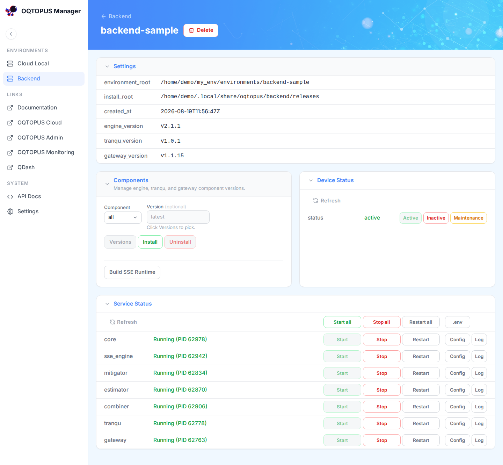

<!-- markdownlint-disable MD041 -->

# OQTOPUS Manager

## Overview

**OQTOPUS Manager** is a local/on-prem management application for the OQTOPUS ecosystem. It lets operators
manage multiple environments on a single host, installing and updating components like a package manager, and
starting, stopping, and restarting their services. It also works as a day-to-day operations tool, with log
viewing and configuration editing built in.

## Usage

- [Getting Started](./usage/getting_started.md)
- [Cloud Local Environments](./usage/cloud_local.md)
- [Backend Environments](./usage/backend.md)
- [Configuration](./usage/configuration.md)
- [Authentication](./usage/authentication.md)
- [Permissions](./usage/permissions.md)

## API reference

- [API reference](./reference/API_reference.md)

## Developer Guidelines

- [Development Flow](./developer_guidelines/development_flow.md)
- [Setup Development Environment](./developer_guidelines/setup.md)
- [Access Control](./developer_guidelines/access_control.md)
- [Permissions API](./developer_guidelines/permissions.md)
- [How to Contribute](./CONTRIBUTING.md)
- [Code of Conduct](https://github.com/oqtopus-team/.github/blob/main/CODE_OF_CONDUCT.md)
- [Security](https://github.com/oqtopus-team/.github/blob/main/SECURITY.md)

## Citation

You can use the DOI to cite oqtopus-auth in your research.

Citation information is also available in the [CITATION](https://github.com/oqtopus-team/oqtopus-manager/blob/main/CITATION.cff) file.

## Contact

You can contact us by creating an issue in this repository or by email:

- [oqtopus-team[at]googlegroups.com](mailto:oqtopus-team[at]googlegroups.com)

## License

OQTOPUS Manager is released under the [Apache License 2.0](https://github.com/oqtopus-team/oqtopus-manager/blob/main/LICENSE).
