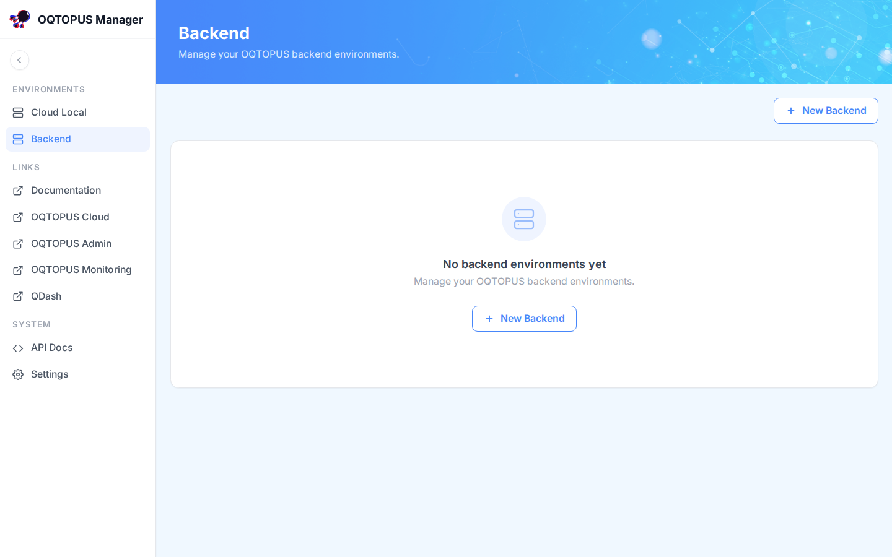
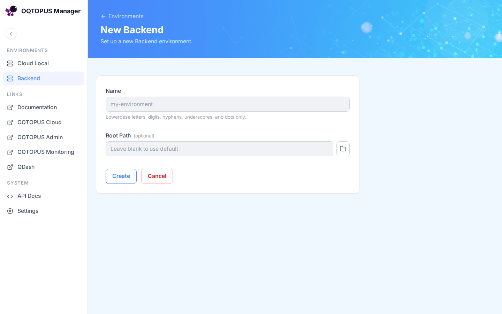
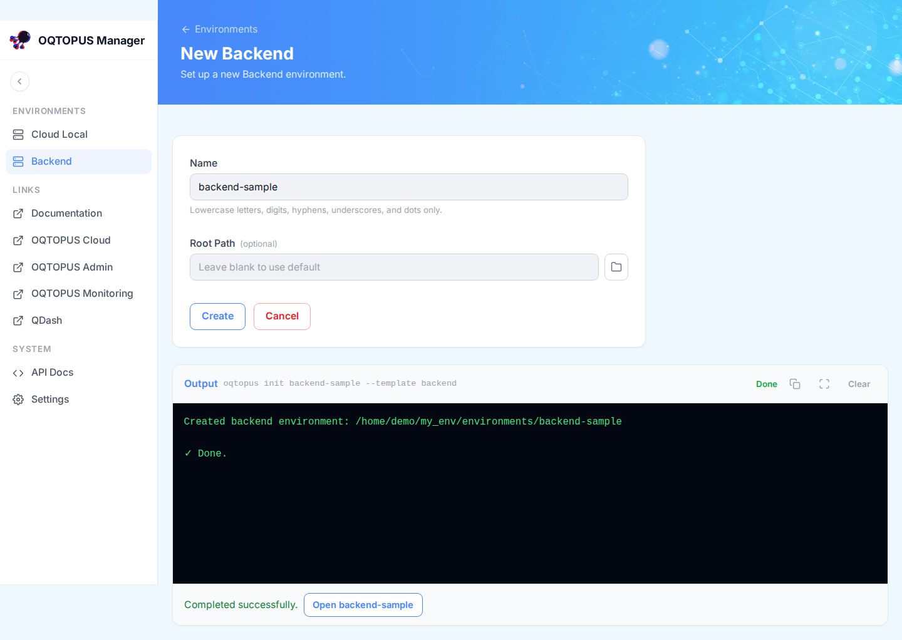
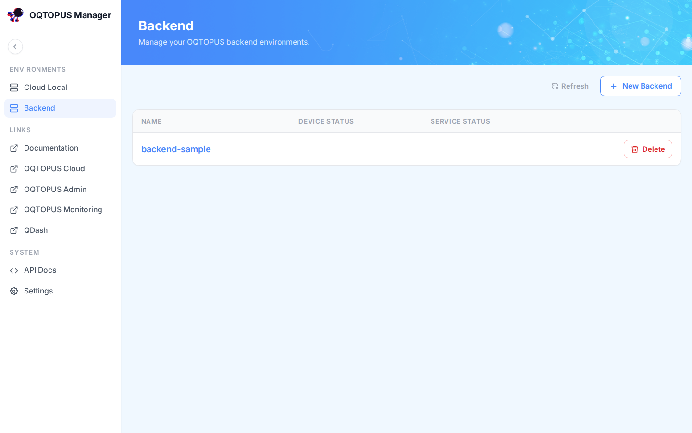
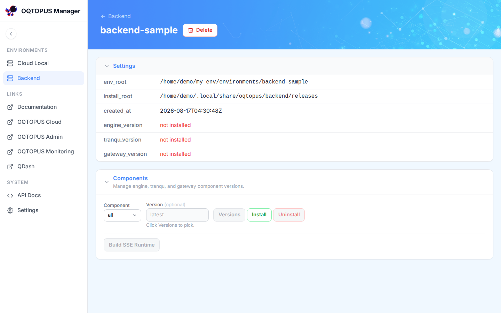
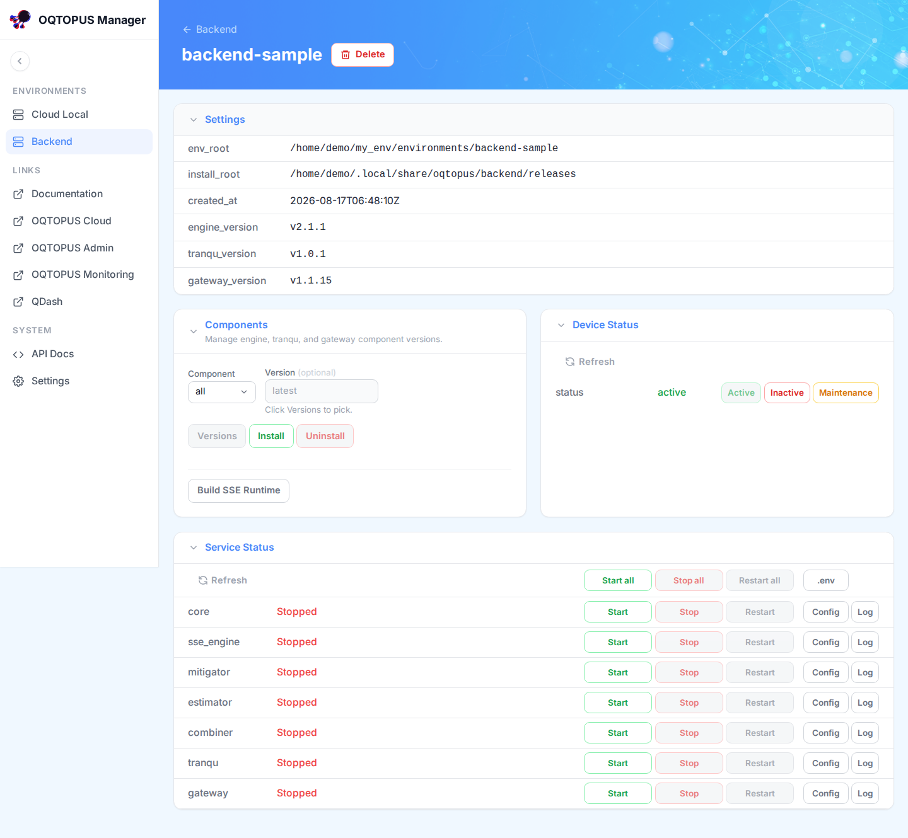
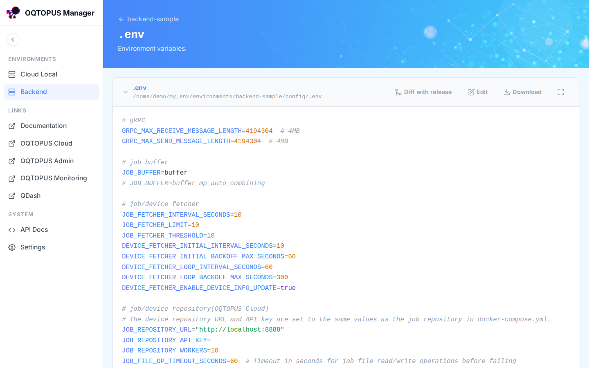
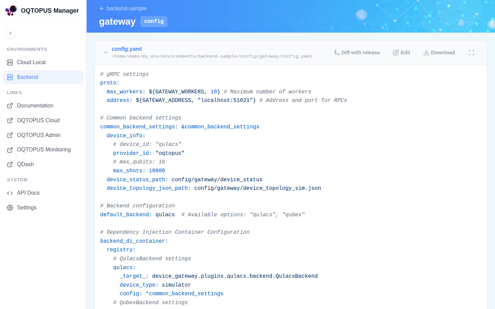
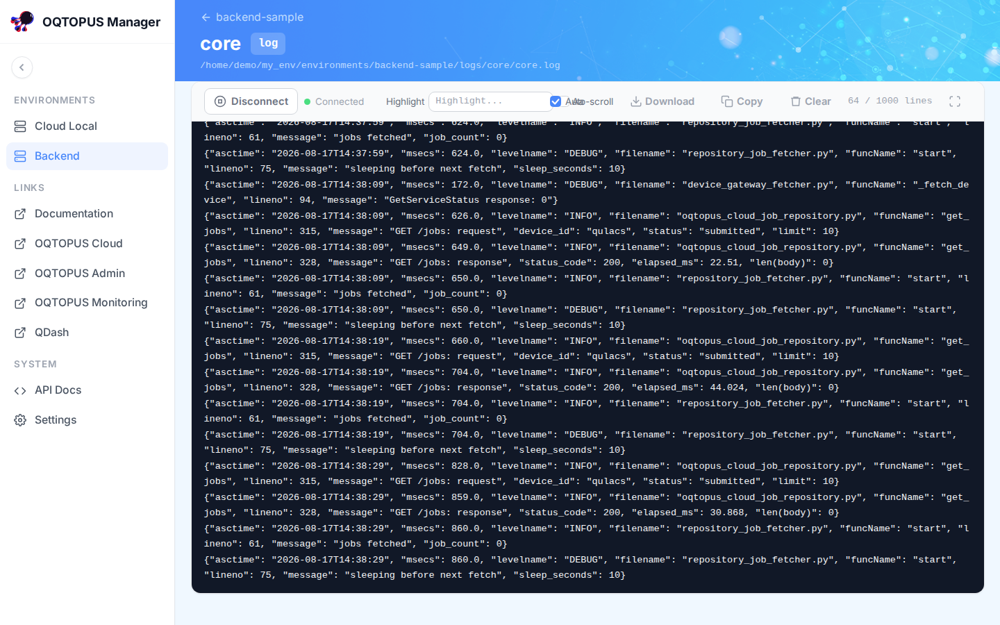

# Backend Environments

A **Backend** environment is an OQTOPUS Backend deployment that OQTOPUS Manager creates, installs, starts, and
monitors on your behalf. This page walks through the full lifecycle: create, install components, start services,
and check on a running environment.

!!! note "Prerequisites"
    [Docker](https://docs.docker.com/get-docker/) must be installed and running. **Build SSE Runtime** builds
    a Docker image that the `sse_engine` service uses.

## Create

Click **Backend** in the sidebar. With no environments yet, the list is empty:

Click **New Backend**, give the environment a name, and submit:

The name is passed to `oqtopus init`, and its output streams live in the page:

The environment now appears in the list. Its **Device Status** and **Service Status** are blank because no
components have been installed yet:

## Install components

Open the environment's detail page. The **Settings** panel shows where it lives on disk, and the **Components**
panel lets you install the `engine`, `tranqu`, and `gateway` components, individually or all at once, optionally
pinned to a specific version:

Pick a component (or `all`), optionally a version, and click **Install**. Installing runs `oqtopus backend
install` and streams its output the same way environment creation does.

Once `engine` is installed, **Build SSE Runtime** becomes available. Click it to build the Docker image the
`sse_engine` service uses to run submitted programs.

## Start services

With every component installed and built, **Device Status** and **Service Status** appear, and every service
starts out stopped:

In **Service Status**, click **Start all** (or start/stop/restart individual services: `core`, `sse_engine`,
`mitigator`, `estimator`, `combiner`, `tranqu`, `gateway`). Once running, the detail page reflects it:

The list page reflects it too:

## Device status

The **Device Status** panel shows the device's current status as reported by the gateway service, with buttons
to set it to `active`, `inactive`, or `maintenance`. This is the same status shown in the list's **Device
Status** column.

## View .env

The **.env** button on the environment detail page opens the environment's `config/.env` file, with a
diff-with-release view, download, and editing:

## View service config

Each service row in **Service Status** has a **Config** button that opens its `config.yaml` and `logging.yaml`,
with the same diff-with-release view, download, and editing as the `.env` editor. For `gateway`, this is also
where the device backend (`qulacs` or `qubex`), device info, and topology settings live:

## View logs

Each service row also has a **Log** button that opens a log viewer that updates live as new lines are written,
with highlighting, auto-scroll, and download:

## Delete

**Delete** on the list or detail page removes the environment's registration and on-disk directory after a
confirmation prompt. If any service is still running, deletion fails with an error. Stop all services first,
then delete.
