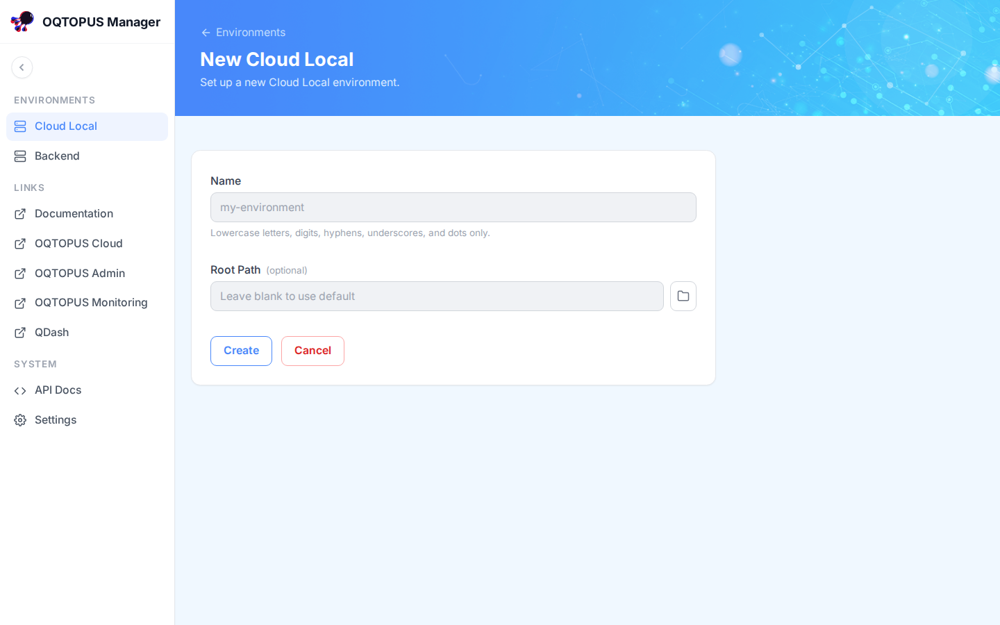
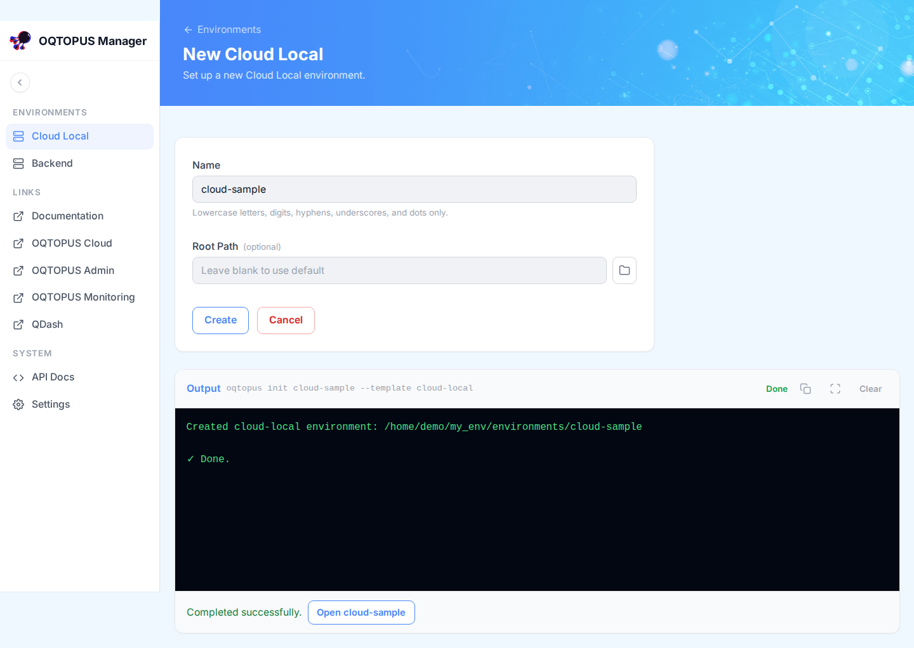
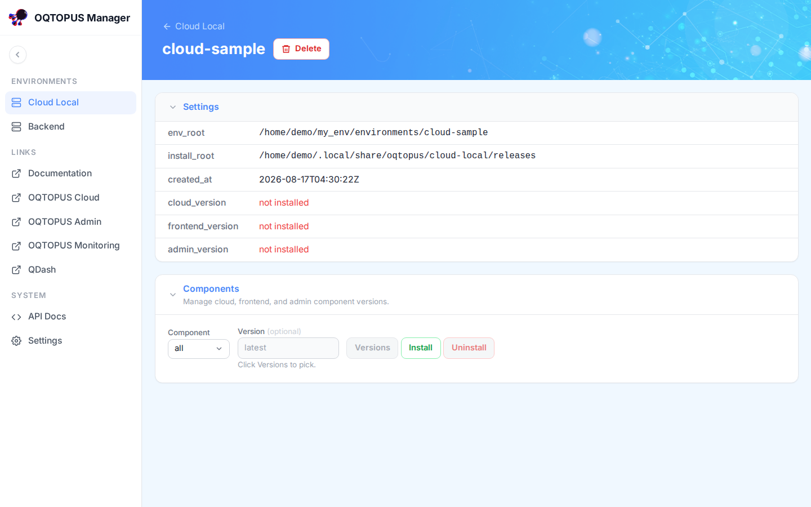
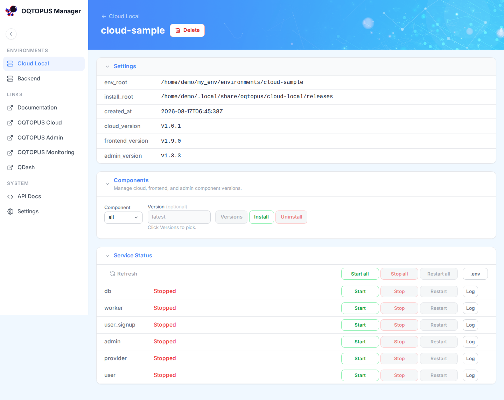
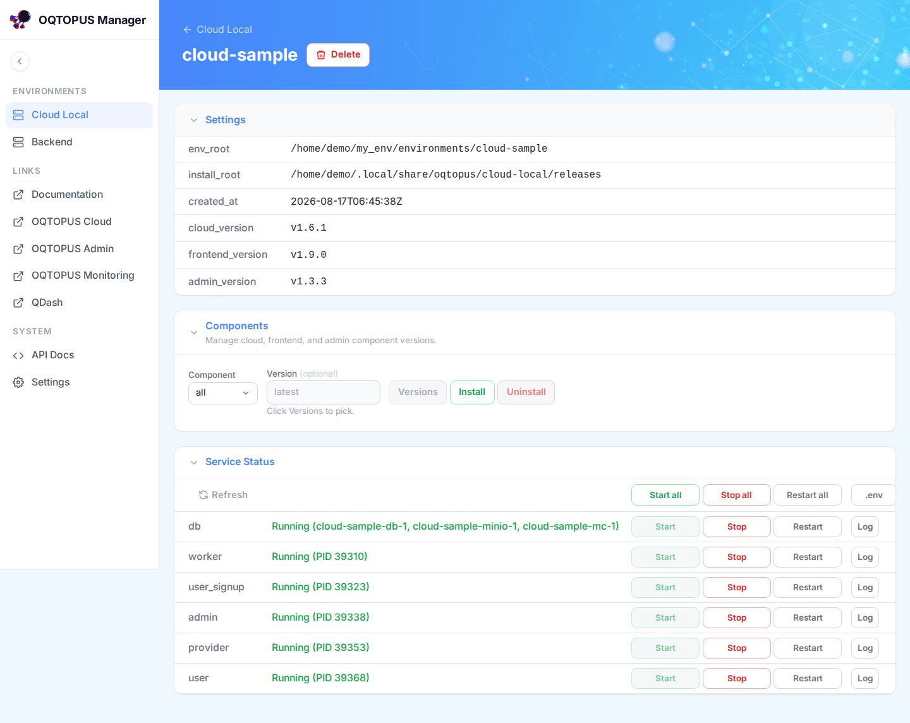
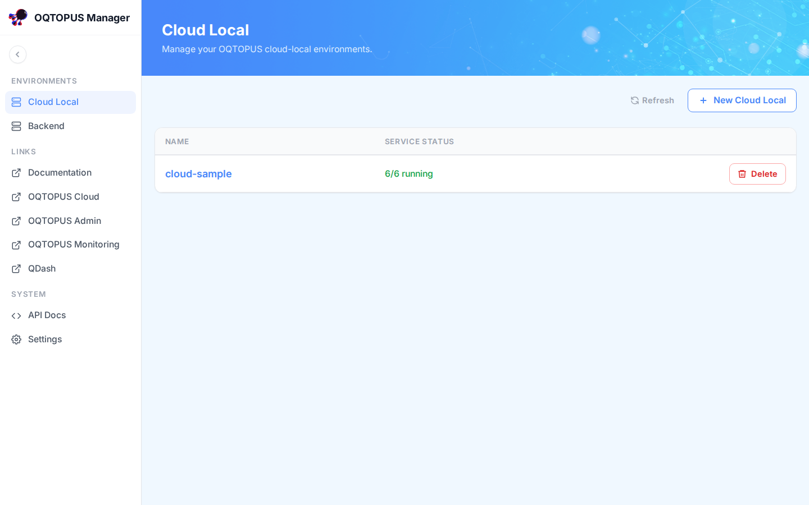
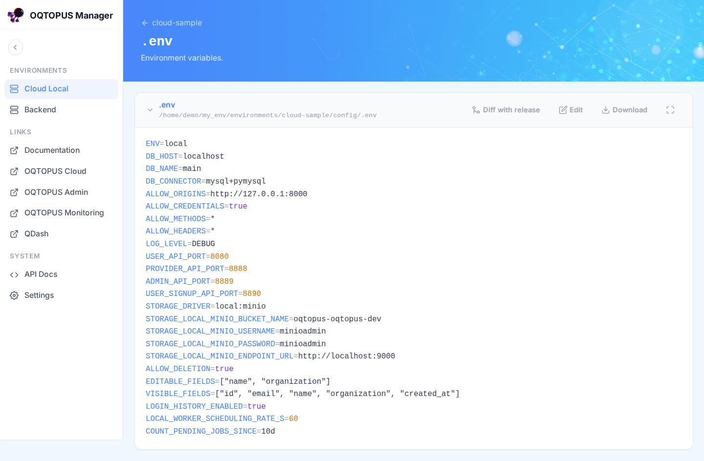
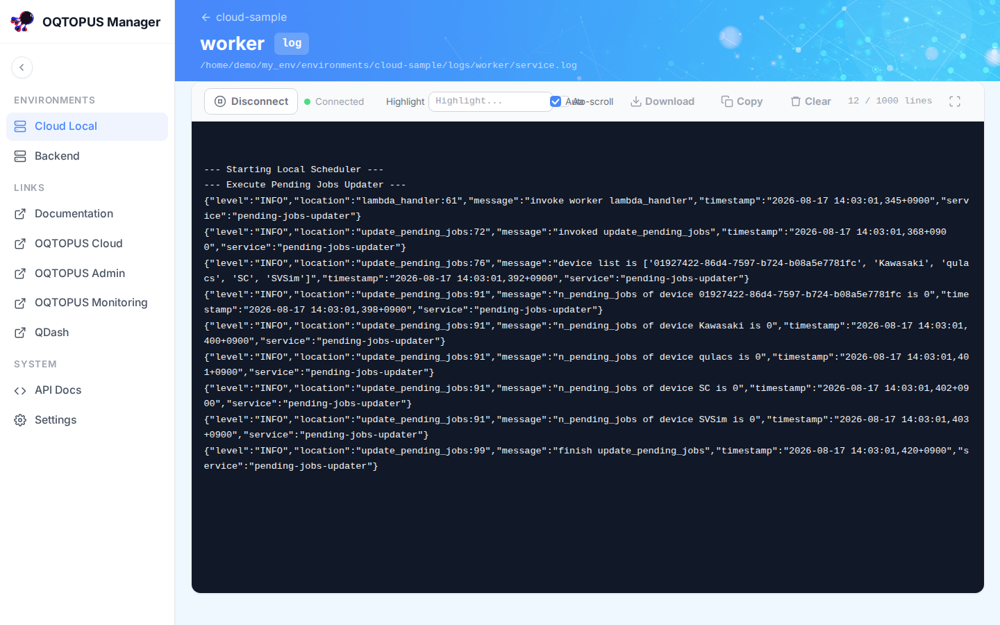

# Cloud Local Environments

A **Cloud Local** environment is an OQTOPUS Cloud deployment that OQTOPUS Manager creates, installs, starts, and
monitors on your behalf. This page walks through the full lifecycle: create, install components, start services,
and check on a running environment.

!!! note
    "Cloud Local" installs and runs OQTOPUS Cloud locally, on-prem, on the machine where OQTOPUS Manager is
    running. It does not install or provision anything on a public cloud.

!!! note "Prerequisites"
    [Docker](https://docs.docker.com/get-docker/) must be installed and running. The `db` service runs MySQL
    and MinIO as Docker containers.

## Create

Click **Cloud Local** in the sidebar. With no environments yet, the list is empty:

Click **New Cloud Local**, give the environment a name, and submit:

The name is passed to `oqtopus init`, and its output streams live in the page:

The environment now appears in the list. Its **Service Status** is blank because no components have been
installed yet:

## Install components

Open the environment's detail page. The **Settings** panel shows where it lives on disk, and the **Components**
panel lets you install the `cloud`, `frontend`, and `admin` components, individually or all at once, optionally
pinned to a specific version:

Pick a component (or `all`), optionally a version, and click **Install**. Installing runs `oqtopus cloud-local
install` and streams its output the same way environment creation does.

## Start services

Once every component is installed, the **Service Status** panel appears with every service stopped:

Click **Start all** (or start/stop/restart individual services: `db`, `worker`, `user_signup`, `admin`,
`provider`, `user`). Once running, the detail page reflects it:

The list page reflects it too:

## View .env

The **.env** button on the environment detail page opens the environment's `config/.env` file, with a
diff-with-release view, download, and editing:

## View logs

Each service row has a **Log** button that opens a log viewer that updates live as new lines are written, with
highlighting, auto-scroll, and download:

## Delete

**Delete** on the list or detail page removes the environment's registration and on-disk directory after a
confirmation prompt. If any service is still running, deletion fails with an error. Stop all services first,
then delete.
