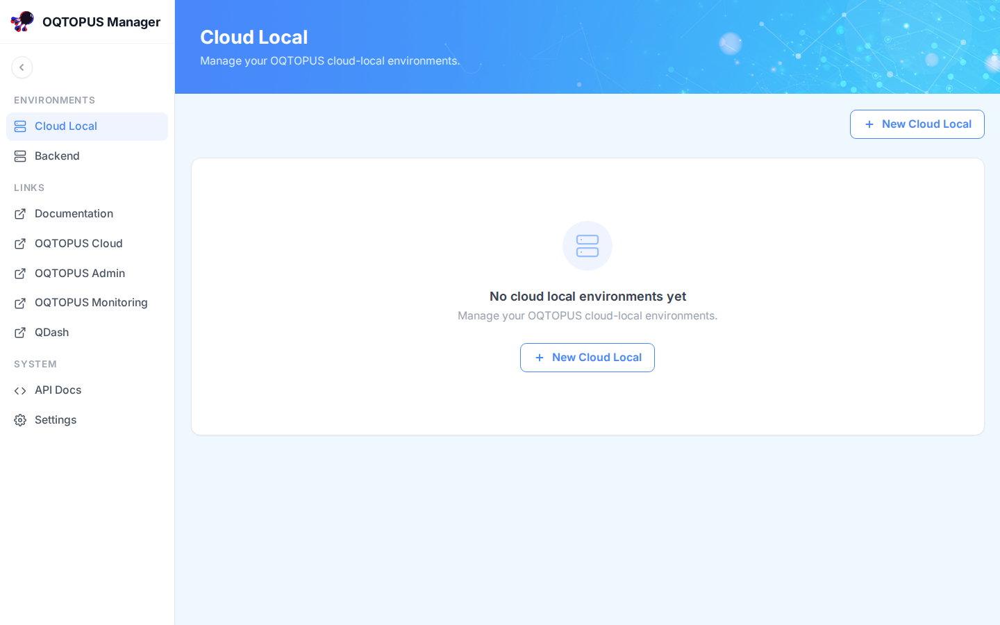
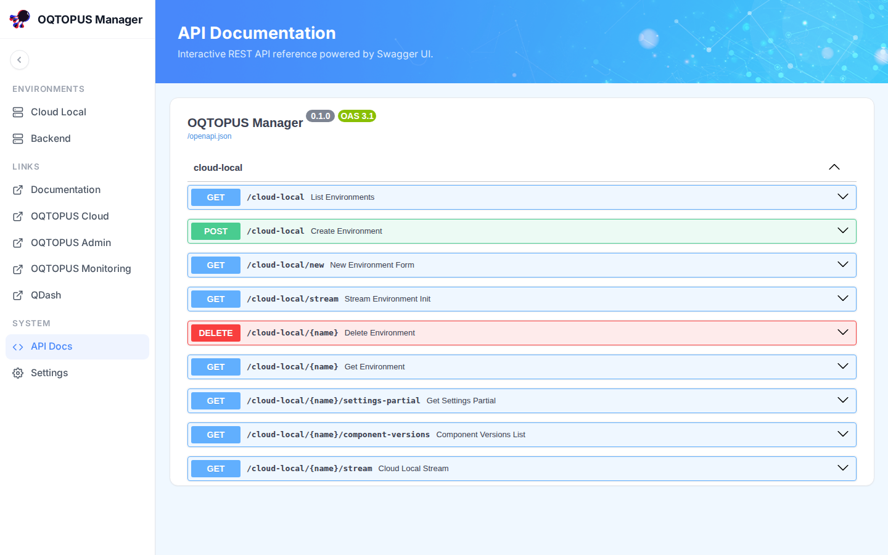

# Getting Started

## Prerequisites

| Tool | Version | Description |
|------|---------|-------------|
| [Python](https://www.python.org/downloads/) | >=3.14 | Python programming language |
| [uv](https://docs.astral.sh/uv/) | >=0.10 | Python package and project manager |

!!! note "Windows"
    Windows is not supported natively. Windows users should run OQTOPUS Manager inside
    [WSL](https://learn.microsoft.com/en-us/windows/wsl/install).

## Quick Start

### 1. Run the quickstart script

!!! note
    Replace `<env_name>` in the command below with the name of the environment directory to create.

```shell
curl -LsSf https://raw.githubusercontent.com/oqtopus-team/oqtopus-manager/main/bin/quickstart.sh \
  | sh -s -- <env_name>
```

This command will:

- Install [OQTOPUS CLI](https://github.com/oqtopus-team/oqtopus-cli) if it is not already installed
- Run `oqtopus init <env_name> --template manager`
- Run `oqtopus manager install`, which installs dependencies and copies `config/config.yaml.example` to `config/config.yaml` if it does not already exist

Available options:

| Option | Description |
|--------|--------------|
| `--version <version\|branch:<branch>>` | Install a specific version of OQTOPUS Manager, e.g. `--version 1.2.0` or `--version branch:feat/some-feature` |
| `--skip-cli-install` | Skip installing OQTOPUS CLI if it is already installed |
| `-h`, `--help` | Show usage information |

Edit `<env_name>/config/config.yaml` to match your environment before starting the application.
See [Configuration](configuration.md) for the full reference.

### 2. Start the application

```shell
cd <env_name>
oqtopus manager start
```

Open [http://localhost:38000](http://localhost:38000) in your browser. You should see an empty environment list for
each template type enabled in `appearance.environment_templates`:



### 3. Check status and stop the application

```shell
oqtopus manager status
```

```shell
oqtopus manager stop
```

For the full command reference of `oqtopus manager` (including `restart`) and other `oqtopus` commands, see the
OQTOPUS Manager section of [the OQTOPUS CLI documentation](https://oqtopus-cli.readthedocs.io/).

## Next steps

Using OQTOPUS Manager, you can install, start, and stop operations for an OQTOPUS Cloud local environment and a
Backend environment. These are deployments that OQTOPUS Manager itself manages, created from within the
application:

- [Cloud Local Environments](cloud_local.md): create, install, and run your first one
- [Backend Environments](backend.md): create, install, and run your first one

## Links

The sidebar's **LINKS** section (visible in the screenshots above) can hold any number of custom entries, each
with its own label and URL. Use it for links to your organization's OQTOPUS Cloud console, monitoring
dashboards, or internal documentation. See `sidebar_links` under [appearance](configuration.md#appearance) for
how to configure them.

## API Docs

Besides the auto-generated Python reference in the sidebar, the running application serves an interactive
Swagger UI at `/api-docs`, covering every REST endpoint OQTOPUS Manager exposes:



## Configuration and Security

OQTOPUS Manager is configured via `config/config.yaml`.
See the following pages for details:

- [Configuration](configuration.md) — server, behavior, appearance, and debug settings
- [Authentication](authentication.md) — reverse proxy authentication and Cognito setup
- [Permissions](permissions.md) — permission-based and role-based access control
