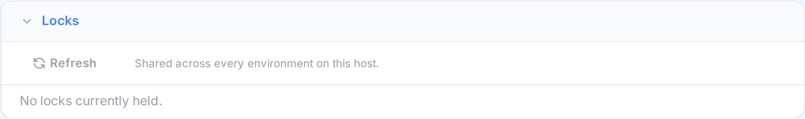
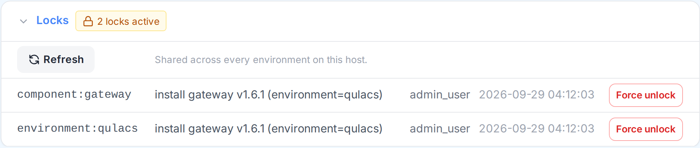

# Exclusive Locks

## Overview

This applies equally to all environments, regardless of type (**Backend**, **Cloud Local**, or any
other kind added later) — they all go through the same locking mechanism, described here once.

Install, uninstall, update, build, start, stop, restart, environment creation, and environment
deletion all run through the `oqtopus` CLI as a subprocess, and several of these operations write
to data that is **shared** rather than private to one environment:

- A component's release directory (`engine`, `gateway`, `tranqu` for Backend; `cloud`, `frontend`,
  `admin` for Cloud Local) lives outside any single environment and is reused by every environment
  on the same machine that resolves to the same version.
- The `sse_engine` service's Docker image, built by **Build SSE Runtime** (Backend only — Cloud
  Local has no equivalent), lives in the host's Docker image store, also shared across
  environments.

Running two such operations against the same shared resource at the same time can corrupt it —
for example, installing `gateway` from two different Backend environments at once can interleave
two extractions into the same release directory. OQTOPUS Manager prevents this with an **exclusive
lock** per shared resource: a second operation that targets a resource already in use waits for
the first one to finish before it starts.

## What gets locked

Locks are scoped to the smallest resource that's actually shared, so unrelated operations never
wait on each other:

| Operation | What it waits for |
|---|---|
| `install` / `uninstall` / `update` `<component>` | That component (host-wide) + this environment |
| `install all` | Every component (host-wide) + this environment |
| `start` / `stop` / `restart` `<service>` | That service, in this environment only |
| `start` / `stop` / `restart all` | Every service in this environment |
| Create environment | This environment (by name) |
| Delete environment | This environment (services + the environment itself) |
| Build SSE Runtime | The `engine` component (host-wide) |
| Device status, `versions` | Nothing — read-only |

Two consequences follow directly from this table:

- Installing `gateway` in environment A and starting `core` in environment B never wait on each
  other — different resources entirely.
- Starting `core` and starting `gateway` *in the same environment* don't wait on each other either
  — they're different services. Only two operations on the genuinely same component or the same
  service, anywhere, ever queue behind one another.

### Cloud Local: container-backed services

Cloud Local's `db` service runs as a Docker container rather than a plain process. Starting or
stopping `db` locks a shared "container group" scope for that environment rather than just `db`
itself, so that a future container-backed service added alongside it would correctly wait its turn
too. Today `db` is the only such service, so in practice this behaves exactly like locking `db` on
its own — it doesn't change anything about `worker`, `admin`, or any other Cloud Local service,
which each still lock only themselves.

## What you'll notice

If you start an operation while another one already holds the resource it needs, your request
simply **waits** — the console shows nothing until the earlier operation finishes and yours
begins. This is expected, not a hang: a long-running `install` in another environment can make an
unrelated `install` of the *same* component wait its turn.

## Timeouts

Every locked operation has a timeout (`behavior.oqtopus_cli_operation_timeout_sec` in
`config.yaml`, default 10 minutes — see [Configuration](configuration.md)). If the underlying CLI
process hasn't finished by then, OQTOPUS Manager kills it, releases the lock, and reports a
timeout in the console.

A timed-out `install` or `update` can leave the target component in an incomplete state. This is
expected and self-healing: the CLI detects an incomplete install and re-extracts it from scratch
the next time you install that same component, so **re-running the install is the recovery step**.

## Viewing locks in the UI

Every environment's detail page has a **Locks** panel, right below Service Status. It stays
collapsed and quiet when nothing is held, so it never gets in the way of the console or Service
Status above it:

As soon as anything is locked — anywhere, not just in this environment, since component locks are
shared across the whole host — a small badge appears with the count. Click it to expand the same
information `GET .../locks` returns: each lock's scope, the operation holding it, who started it,
and since when, plus a **Force unlock** button per row:

The panel refreshes automatically every few seconds (and on demand via **Refresh**), so it reflects
locks taken out from any other environment's page, or by another person's session, without needing
to reload.

## If a lock seems stuck

`GET /api/backend/{name}/locks` and `GET /api/cloud-local/{name}/locks` list every lock currently
held, with what operation holds it, who started it, and since when — useful for confirming whether
an operation is still genuinely running or has been stuck far longer than it should ever take.
Either one shows the same, complete picture regardless of which environment's `{name}` you ask
through: a lock blocking your Backend install may have been taken out by a different Backend
environment, so the full snapshot is more useful here than a per-environment view would be. The
**Locks** panel described above is a thin UI over this same endpoint.

If you're confident a lock is stuck rather than merely slow, click **Force unlock** next to it in
the panel (or `POST /api/backend/{name}/locks/force-unlock?scope=<scope>` / the `cloud-local`
equivalent directly — either works, since both act on the same underlying set of locks).

!!! warning
    Force-unlocking does **not** stop the underlying CLI process — it may still be running and
    still writing to the resource the lock was protecting. Force-unlocking lets a *new* operation
    start concurrently with it, which is exactly the kind of collision locking exists to prevent.
    Use it only after confirming with `GET .../locks` that the holder is actually stuck, not just
    slow.

These endpoints, and the Force unlock button, require the same permission as the operation they
cover (`environment.service.manage` — see [Permissions](permissions.md)).

## Limitations

- Locks live only in the Manager process's memory. Restarting Manager clears every lock — an
  in-flight operation loses its protection rather than staying stuck forever, which means a
  restart during an operation can allow a rare double-run, but never a permanently jammed lock.
- Locks only coordinate operations that go through OQTOPUS Manager. Running the `oqtopus` CLI
  directly on the host, outside of Manager, bypasses them entirely.
- Locks don't coordinate across multiple Manager processes sharing the same filesystem (not a
  supported deployment today).

For implementation details (the `LockRegistry` API, how it wires into the streaming CLI wrapper,
and how to add locking to a new operation), see
[Developer Guidelines — Exclusive Locks](../developer_guidelines/locks.md).
